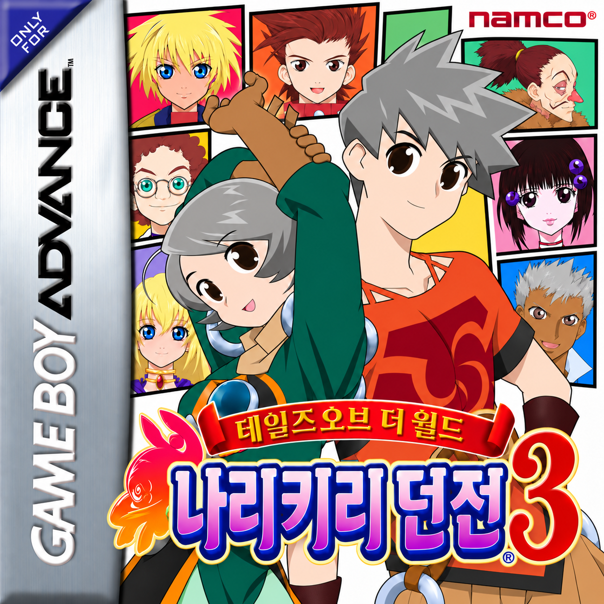

# 테일즈 오브 더 월드 나리키리 던전 3 한국어화

  

짜알님의 기존 한국어화 1.1을 허가받아 계승하는 프로젝트입니다. Xagros가 후속 작업을 진행하며, 남아 있는 미번역 텍스트와 8×8 소형 글꼴 표시를 보완합니다.

**v1.1a 개발 중입니다. 100% 완성판이나 공개 배포용 최종판이 아닙니다.**

기존 번역과 제작자 크레딧을 유지하고, 공식 가이드북 및 사용자가 제공한 인물·코스튬 표기를 대조합니다. 일본판 B3TJ 원본에 적용하는 누적 패치를 제작하고 있습니다. 게임 ROM·BIOS·개인 세이브는 저장소에 포함하지 않습니다.

- [현재 작업 상태와 확인 범위](docs/STATUS.md)
- [제작자와 출처](CREDITS.md)
- [개발 검토판 안내](docs/REVIEW_README.md)
- [누적 개발판 재현 방법](docs/BUILDING.md)
- [인물·코스튬 용어 기준](translations/terminology.json)

로고는 Xagros가 2026-09-13 교체용으로 제공한 원본 파일입니다. 파일을 변형하지 않고 사용합니다. 게임과 원본 도안의 권리는 각 권리자에게 있습니다.
