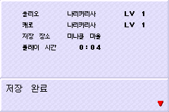
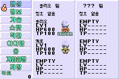
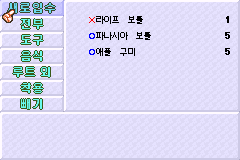
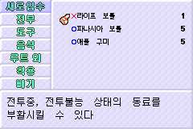

# v1.1a 검증 자료

[검증 요약](verification-summary.json)에 30개 검사 결과와 정확한 ROM·코어·저장·배포 ZIP의 해시를 기록했습니다. [재현 기록](reproduction.json)은 빌드 입력 파일과 도구의 해시를 보존합니다.

두 PC 코어에서 확인한 새 게임 저장, 별도 실행 후 메뉴와 아이템 화면입니다. 두 코어의 각 캡처 해시는 검증 요약에 각각 기록되어 있습니다. 아래 대표 이미지는 mGBA에서 얻었습니다.

합성 해금 세이브에서 일반 버튼으로 상점에 들어가 확인한 멜의 상담과 디오의 루트 매매 설명입니다. 정상 해금 과정의 검증은 아닙니다.

